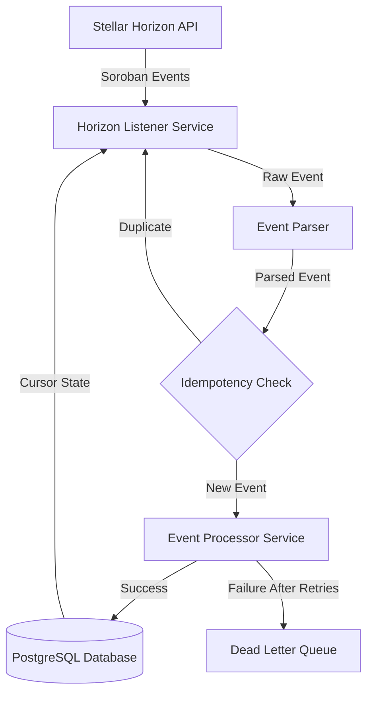
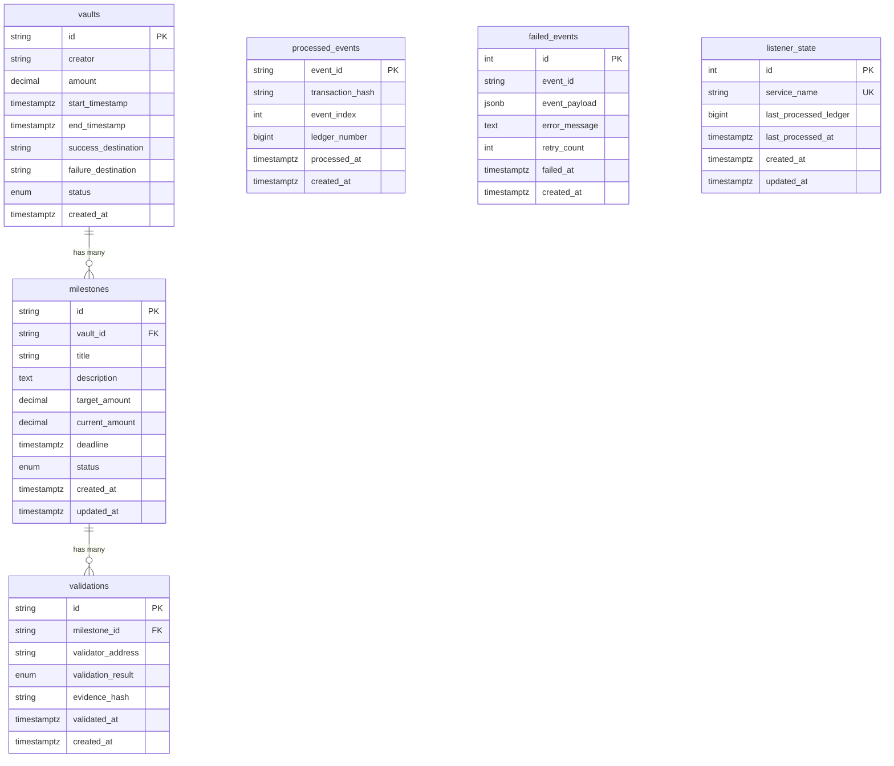

# Design Document: Horizon Listener → Database Sync

## Overview

The Horizon Listener → Database Sync feature bridges the Soroban blockchain and the Disciplr backend database by consuming contract events from the Stellar Horizon API and translating them into PostgreSQL database operations. This design ensures real-time synchronization of on-chain vault, milestone, and validation activities with the backend's data layer.

The system follows an event-driven architecture where a long-running listener service connects to Horizon, receives Soroban contract events, validates and parses them, and processes them idempotently into database records. The design emphasizes reliability through retry logic, dead letter queuing, cursor persistence for resumability, and comprehensive audit logging.

Key design goals:
- Idempotent event processing to handle retries safely
- Resumable operation after restarts via ledger cursor persistence
- Robust error handling with exponential backoff and dead letter queue
- Clean separation of concerns between listening, parsing, and processing
- Testability through dependency injection and mocked event fixtures

## Architecture

### High-Level Architecture



### Component Responsibilities

**Horizon Listener Service** (`src/services/horizonListener.ts`)
- Establishes and maintains connection to Stellar Horizon API using Stellar SDK
- Filters events by configured contract addresses
- Manages ledger cursor for resumable operation
- Handles connection failures with exponential backoff
- Coordinates graceful shutdown on SIGTERM/SIGINT

**Event Parser** (`src/services/eventParser.ts`)
- Decodes Soroban event data from XDR format to JavaScript objects
- Validates event structure and required fields
- Extracts event metadata (transaction hash, event index, ledger number)
- Returns structured validation errors for malformed events

**Event Processor Service** (`src/services/eventProcessor.ts`)
- Checks idempotency store before processing
- Routes events to appropriate handlers (vault, milestone, validation)
- Executes database operations within transactions
- Implements retry logic with exponential backoff for transient failures
- Moves failed events to dead letter queue after exhausting retries
- Updates ledger cursor on successful processing
- Creates audit logs for all processing outcomes

**Database Layer** (`src/db/`)
- Knex-based query builder for type-safe database operations
- Migration files for schema versioning
- Connection pooling and transaction management

### Data Flow

1. **Event Reception**: Horizon Listener receives event from Stellar Horizon API
2. **Parsing**: Event Parser decodes XDR and validates structure
3. **Idempotency Check**: Event Processor queries `processed_events` table
4. **Processing**: If new, Event Processor executes database operations in transaction
5. **Cursor Update**: On success, update `listener_state` with latest ledger
6. **Audit Logging**: Record processing outcome in audit logs
7. **Error Handling**: On failure, retry with backoff or move to dead letter queue

### Technology Stack

- **Runtime**: Node.js 22+ with TypeScript
- **Blockchain SDK**: `@stellar/stellar-sdk` for Horizon API integration
- **Database**: PostgreSQL 14+ with Knex query builder
- **Web Framework**: Express (existing)
- **Testing**: Jest with ts-jest for unit and integration tests
- **Process Management**: Native Node.js signal handling for graceful shutdown

## Components and Interfaces

### Horizon Listener Service

**File**: `src/services/horizonListener.ts`

**Configuration Interface**:
```typescript
interface HorizonListenerConfig {
  horizonUrl: string
  contractAddresses: string[]
  startLedger?: number
  retryMaxAttempts: number
  retryBackoffMs: number
  shutdownTimeoutMs: number
}
```

**Public Interface**:
```typescript
class HorizonListener {
  constructor(
    config: HorizonListenerConfig,
    eventProcessor: EventProcessor,
    db: Knex
  )
  
  async start(): Promise<void>
  async stop(): Promise<void>
  isRunning(): boolean
}
```

**Key Methods**:
- `start()`: Initializes Horizon connection, loads cursor from database, begins event streaming
- `stop()`: Initiates graceful shutdown, waits for in-flight events, closes connections
- `handleEvent(event: HorizonEvent)`: Processes individual event through parser and processor
- `updateCursor(ledger: number)`: Persists latest processed ledger to database
- `reconnectWithBackoff()`: Implements exponential backoff for connection failures

**Error Handling**:
- Connection failures trigger exponential backoff (1s → 2s → 4s → ... → 60s max)
- Malformed events are logged and skipped without retry
- Database errors during cursor update are logged but don't stop listener

### Event Parser

**File**: `src/services/eventParser.ts`

**Event Type Definitions**:
```typescript
type EventType = 
  | 'vault_created'
  | 'vault_completed'
  | 'vault_failed'
  | 'vault_cancelled'
  | 'milestone_created'
  | 'milestone_validated'

interface ParsedEvent {
  eventId: string
  transactionHash: string
  eventIndex: number
  ledgerNumber: number
  eventType: EventType
  payload: VaultEventPayload | MilestoneEventPayload | ValidationEventPayload
}

interface VaultEventPayload {
  vaultId: string
  creator?: string
  amount?: string
  startTimestamp?: Date
  endTimestamp?: Date
  successDestination?: string
  failureDestination?: string
  status?: 'active' | 'completed' | 'failed' | 'cancelled'
}

interface MilestoneEventPayload {
  milestoneId: string
  vaultId: string
  title: string
  description: string
  targetAmount: string
  deadline: Date
}

interface ValidationEventPayload {
  validationId: string
  milestoneId: string
  validatorAddress: string
  validationResult: 'approved' | 'rejected' | 'pending_review'
  evidenceHash: string
  validatedAt: Date
}
```

**Public Interface**:
```typescript
interface ParseResult {
  success: true
  event: ParsedEvent
} | {
  success: false
  error: string
  details?: Record<string, unknown>
}

function parseHorizonEvent(rawEvent: HorizonEvent): ParseResult
```

**Validation Rules**:
- All events must have transaction hash, event index, and ledger number
- Event type must match one of the supported types
- Required fields for each event type must be present
- Data types must match expected schema (strings, numbers, dates)
- XDR decoding errors result in validation failure

### Event Processor Service

**File**: `src/services/eventProcessor.ts`

**Public Interface**:
```typescript
interface ProcessingResult {
  success: boolean
  eventId: string
  error?: string
  retryCount?: number
}

class EventProcessor {
  constructor(db: Knex, config: ProcessorConfig)
  
  async processEvent(event: ParsedEvent): Promise<ProcessingResult>
  async reprocessFailedEvent(failedEventId: string): Promise<ProcessingResult>
}

interface ProcessorConfig {
  maxRetries: number
  retryBackoffMs: number
}
```

**Processing Flow**:
1. Check `processed_events` table for event_id
2. If exists, return success immediately (idempotency)
3. Begin database transaction
4. Route to appropriate handler based on event type
5. Execute database operations
6. Insert event_id into `processed_events`
7. Commit transaction
8. Create audit log entry
9. On failure, retry with exponential backoff or move to DLQ

**Event Handlers**:
```typescript
async function handleVaultEvent(
  event: ParsedEvent,
  trx: Knex.Transaction
): Promise<void>

async function handleMilestoneEvent(
  event: ParsedEvent,
  trx: Knex.Transaction
): Promise<void>

async function handleValidationEvent(
  event: ParsedEvent,
  trx: Knex.Transaction
): Promise<void>
```

**Retry Logic**:
- Transient errors (database connection, deadlock): Retry up to 3 times
- Exponential backoff: 100ms → 200ms → 400ms
- Validation errors: No retry, log and skip
- After max retries: Insert into `failed_events` table

### Database Connection

**File**: `src/db/knex.ts`

```typescript
import knex from 'knex'
import knexConfig from '../../knexfile.cjs'

export const db = knex(knexConfig)

export async function closeDatabase(): Promise<void> {
  await db.destroy()
}
```

## Data Models

### Database Schema

#### Vaults Table (Existing)

Already defined in `20260225190000_initial_baseline.cjs`:
```sql
CREATE TABLE vaults (
  id VARCHAR(64) PRIMARY KEY,
  creator VARCHAR(255) NOT NULL,
  amount DECIMAL(36, 7) NOT NULL,
  start_timestamp TIMESTAMPTZ NOT NULL,
  end_timestamp TIMESTAMPTZ NOT NULL,
  success_destination VARCHAR(255) NOT NULL,
  failure_destination VARCHAR(255) NOT NULL,
  status vault_status NOT NULL DEFAULT 'active',
  created_at TIMESTAMPTZ NOT NULL DEFAULT NOW()
);

CREATE TYPE vault_status AS ENUM ('active', 'completed', 'failed', 'cancelled');
CREATE INDEX idx_vaults_creator ON vaults(creator);
CREATE INDEX idx_vaults_status ON vaults(status);
CREATE INDEX idx_vaults_end_timestamp ON vaults(end_timestamp);
```

#### Milestones Table (New)

**Migration**: `db/migrations/YYYYMMDDHHMMSS_create_milestones.cjs`

```sql
CREATE TABLE milestones (
  id VARCHAR(64) PRIMARY KEY,
  vault_id VARCHAR(64) NOT NULL REFERENCES vaults(id) ON DELETE CASCADE,
  title VARCHAR(255) NOT NULL,
  description TEXT,
  target_amount DECIMAL(36, 7) NOT NULL,
  current_amount DECIMAL(36, 7) NOT NULL DEFAULT 0,
  deadline TIMESTAMPTZ NOT NULL,
  status milestone_status NOT NULL DEFAULT 'pending',
  created_at TIMESTAMPTZ NOT NULL DEFAULT NOW(),
  updated_at TIMESTAMPTZ NOT NULL DEFAULT NOW()
);

CREATE TYPE milestone_status AS ENUM ('pending', 'in_progress', 'completed', 'failed');
CREATE INDEX idx_milestones_vault_id ON milestones(vault_id);
CREATE INDEX idx_milestones_status ON milestones(status);
CREATE INDEX idx_milestones_deadline ON milestones(deadline);
```

**TypeScript Interface**:
```typescript
interface Milestone {
  id: string
  vaultId: string
  title: string
  description: string | null
  targetAmount: string
  currentAmount: string
  deadline: Date
  status: 'pending' | 'in_progress' | 'completed' | 'failed'
  createdAt: Date
  updatedAt: Date
}
```

#### Validations Table (New)

**Migration**: `db/migrations/YYYYMMDDHHMMSS_create_validations.cjs`

```sql
CREATE TABLE validations (
  id VARCHAR(64) PRIMARY KEY,
  milestone_id VARCHAR(64) NOT NULL REFERENCES milestones(id) ON DELETE CASCADE,
  validator_address VARCHAR(255) NOT NULL,
  validation_result validation_result NOT NULL,
  evidence_hash VARCHAR(255),
  validated_at TIMESTAMPTZ NOT NULL,
  created_at TIMESTAMPTZ NOT NULL DEFAULT NOW()
);

CREATE TYPE validation_result AS ENUM ('approved', 'rejected', 'pending_review');
CREATE INDEX idx_validations_milestone_id ON validations(milestone_id);
CREATE INDEX idx_validations_validator_address ON validations(validator_address);
CREATE INDEX idx_validations_validated_at ON validations(validated_at);
```

**TypeScript Interface**:
```typescript
interface Validation {
  id: string
  milestoneId: string
  validatorAddress: string
  validationResult: 'approved' | 'rejected' | 'pending_review'
  evidenceHash: string | null
  validatedAt: Date
  createdAt: Date
}
```

#### Processed Events Table (New)

**Migration**: `db/migrations/YYYYMMDDHHMMSS_create_processed_events.cjs`

```sql
CREATE TABLE processed_events (
  event_id VARCHAR(128) PRIMARY KEY,
  transaction_hash VARCHAR(64) NOT NULL,
  event_index INTEGER NOT NULL,
  ledger_number BIGINT NOT NULL,
  processed_at TIMESTAMPTZ NOT NULL DEFAULT NOW(),
  created_at TIMESTAMPTZ NOT NULL DEFAULT NOW()
);

CREATE INDEX idx_processed_events_transaction_hash ON processed_events(transaction_hash);
CREATE INDEX idx_processed_events_processed_at ON processed_events(processed_at);
CREATE INDEX idx_processed_events_ledger_number ON processed_events(ledger_number);
```

**TypeScript Interface**:
```typescript
interface ProcessedEvent {
  eventId: string
  transactionHash: string
  eventIndex: number
  ledgerNumber: number
  processedAt: Date
  createdAt: Date
}
```

**Event ID Format**: `{transaction_hash}:{event_index}`

#### Failed Events Table (New)

**Migration**: `db/migrations/YYYYMMDDHHMMSS_create_failed_events.cjs`

```sql
CREATE TABLE failed_events (
  id SERIAL PRIMARY KEY,
  event_id VARCHAR(128) NOT NULL,
  event_payload JSONB NOT NULL,
  error_message TEXT NOT NULL,
  retry_count INTEGER NOT NULL DEFAULT 0,
  failed_at TIMESTAMPTZ NOT NULL DEFAULT NOW(),
  created_at TIMESTAMPTZ NOT NULL DEFAULT NOW()
);

CREATE INDEX idx_failed_events_event_id ON failed_events(event_id);
CREATE INDEX idx_failed_events_failed_at ON failed_events(failed_at);
```

**TypeScript Interface**:
```typescript
interface FailedEvent {
  id: number
  eventId: string
  eventPayload: ParsedEvent
  errorMessage: string
  retryCount: number
  failedAt: Date
  createdAt: Date
}
```

#### Listener State Table (New)

**Migration**: `db/migrations/YYYYMMDDHHMMSS_create_listener_state.cjs`

```sql
CREATE TABLE listener_state (
  id SERIAL PRIMARY KEY,
  service_name VARCHAR(64) NOT NULL UNIQUE,
  last_processed_ledger BIGINT NOT NULL,
  last_processed_at TIMESTAMPTZ NOT NULL,
  created_at TIMESTAMPTZ NOT NULL DEFAULT NOW(),
  updated_at TIMESTAMPTZ NOT NULL DEFAULT NOW()
);

CREATE UNIQUE INDEX idx_listener_state_service_name ON listener_state(service_name);
```

**TypeScript Interface**:
```typescript
interface ListenerState {
  id: number
  serviceName: string
  lastProcessedLedger: number
  lastProcessedAt: Date
  createdAt: Date
  updatedAt: Date
}
```

### Entity Relationships




## Correctness Properties

*A property is a characteristic or behavior that should hold true across all valid executions of a system-essentially, a formal statement about what the system should do. Properties serve as the bridge between human-readable specifications and machine-verifiable correctness guarantees.*

### Property 1: Contract Address Filtering

*For any* event received from the Horizon API, if the event's contract address is not in the configured list of contract addresses, then the event should be filtered out and not processed.

**Validates: Requirements 1.5**

### Property 2: Vault Creation Field Mapping

*For any* vault_created event with valid payload, processing the event should result in a vault database record containing all required fields: creator, amount, start_timestamp, end_timestamp, success_destination, failure_destination, and status.

**Validates: Requirements 2.1**

### Property 3: Vault Status Transitions

*For any* vault and any vault status event (vault_completed, vault_failed, vault_cancelled), processing the event should update the vault's status field to match the event type (completed, failed, or cancelled respectively).

**Validates: Requirements 2.2, 2.3, 2.4**

### Property 4: Milestone Creation with Vault Link

*For any* milestone_created event with valid payload, processing the event should result in a milestone database record with a vault_id foreign key that references an existing vault.

**Validates: Requirements 2.5**

### Property 5: Validation Creation with Milestone Link

*For any* milestone_validated event with valid payload, processing the event should result in a validation database record with a milestone_id foreign key that references an existing milestone.

**Validates: Requirements 2.6**

### Property 6: Event ID Storage on Success

*For any* event that is successfully processed, the event's event_id should exist in the processed_events table with the correct transaction_hash, event_index, and ledger_number.

**Validates: Requirements 3.3**

### Property 7: Event ID Format

*For any* event processed by the system, the event_id stored in processed_events should follow the format `{transaction_hash}:{event_index}`.

**Validates: Requirements 3.4**

### Property 8: Idempotent Event Processing

*For any* event, processing the same event multiple times (with the same event_id) should produce the same database state as processing it exactly once. Specifically, duplicate processing should not create additional records or modify existing records beyond the first processing.

**Validates: Requirements 3.2, 3.5**

### Property 9: Invalid Events Skip Without Retry

*For any* event with invalid or malformed payload data, the event processor should log an error, skip the event without retrying, and not insert the event into the failed_events table.

**Validates: Requirements 7.2, 11.5**

### Property 10: Dead Letter Queue After Retry Exhaustion

*For any* event that fails processing due to transient errors, if the event fails all retry attempts (up to max_retries), then the event should be inserted into the failed_events table with the complete event payload and error details.

**Validates: Requirements 7.3, 8.2**

### Property 11: Transaction Atomicity on Failure

*For any* event that fails during processing, no partial database changes from that event should be visible in the database. All changes should be rolled back, maintaining database consistency.

**Validates: Requirements 7.5, 9.3**

### Property 12: Failed Event Payload Completeness

*For any* event in the failed_events table, the event_payload field should contain all original event data including event_id, transaction_hash, event_index, ledger_number, event_type, and the complete payload object.

**Validates: Requirements 8.3**

### Property 13: Cursor Update on Success

*For any* event that is successfully processed, the listener_state table should be updated with the event's ledger_number as the last_processed_ledger, ensuring the listener can resume from the correct position.

**Validates: Requirements 10.2**

### Property 14: Event Parsing Round-Trip

*For any* valid parsed event structure, encoding it to XDR format and then parsing it back should produce an equivalent event structure with the same event_type, event_id, and payload fields.

**Validates: Requirements 11.1, 12.5**

### Property 15: Malformed Event Validation Errors

*For any* event with malformed XDR data or missing required fields, the event parser should return a validation error with details about what is invalid, rather than throwing an exception or returning a parsed event.

**Validates: Requirements 11.2, 11.3, 11.4**

### Property 16: Audit Log on Successful Processing

*For any* event that is successfully processed, an audit log entry should be created containing the action type, event_id, and references to affected database records (vault_id, milestone_id, or validation_id).

**Validates: Requirements 13.1**

### Property 17: Audit Log on Failed Processing

*For any* event that fails processing (after retries), an audit log entry should be created containing the event_id, error message, and retry count.

**Validates: Requirements 13.2**

### Property 18: Audit Log Metadata Completeness

*For any* audit log entry created by event processing, the log should include metadata fields: event_type, transaction_hash, ledger_number, and processing_duration_ms.

**Validates: Requirements 13.4**

### Property 19: Required Configuration Validation

*For any* attempt to start the Horizon Listener, if any required configuration value (HORIZON_URL, CONTRACT_ADDRESS) is missing or invalid, the listener should fail to start and log an error message indicating which configuration is missing.

**Validates: Requirements 14.2, 14.3**

## Error Handling

### Error Categories

The system distinguishes between three categories of errors, each with different handling strategies:

**1. Transient Errors** (Retryable)
- Database connection failures
- Database deadlocks or lock timeouts
- Horizon API connection failures
- Network timeouts

**Handling**: Retry up to 3 times with exponential backoff (100ms → 200ms → 400ms). After exhausting retries, move to dead letter queue.

**2. Validation Errors** (Non-Retryable)
- Malformed XDR data
- Missing required fields
- Invalid data types
- Schema validation failures

**Handling**: Log error with details, skip event without retry, do not add to dead letter queue. These represent data quality issues that won't be resolved by retrying.

**3. System Errors** (Fatal)
- Missing required configuration
- Database migration failures
- Unable to establish initial Horizon connection

**Handling**: Log error and exit process with non-zero status code. These require operator intervention.

### Retry Strategy

```typescript
interface RetryConfig {
  maxAttempts: number // Default: 3
  initialBackoffMs: number // Default: 100
  maxBackoffMs: number // Default: 60000
  backoffMultiplier: number // Default: 2
}

async function retryWithBackoff<T>(
  operation: () => Promise<T>,
  config: RetryConfig,
  isRetryable: (error: Error) => boolean
): Promise<T> {
  let lastError: Error
  let backoffMs = config.initialBackoffMs
  
  for (let attempt = 1; attempt <= config.maxAttempts; attempt++) {
    try {
      return await operation()
    } catch (error) {
      lastError = error
      
      if (!isRetryable(error) || attempt === config.maxAttempts) {
        throw error
      }
      
      await sleep(backoffMs)
      backoffMs = Math.min(backoffMs * config.backoffMultiplier, config.maxBackoffMs)
    }
  }
  
  throw lastError
}
```

### Error Logging

All errors are logged with structured context:

```typescript
interface ErrorLogContext {
  eventId?: string
  transactionHash?: string
  ledgerNumber?: number
  eventType?: string
  errorMessage: string
  errorStack?: string
  retryCount: number
  processingDurationMs: number
}
```

Log levels:
- **ERROR**: Validation errors, exhausted retries, system errors
- **WARN**: Transient errors during retry attempts
- **INFO**: Successful recovery after retry

### Dead Letter Queue Management

Events in the dead letter queue can be:
1. **Inspected**: Query `failed_events` table to analyze failure patterns
2. **Reprocessed**: Call `eventProcessor.reprocessFailedEvent(eventId)` after fixing underlying issues
3. **Archived**: Move old failed events to archive table for historical analysis

Reprocessing workflow:
```typescript
// Manual reprocessing after fixing issue
const failedEvent = await db('failed_events')
  .where({ event_id: eventId })
  .first()

const result = await eventProcessor.processEvent(
  JSON.parse(failedEvent.event_payload)
)

if (result.success) {
  await db('failed_events').where({ event_id: eventId }).delete()
}
```

### Transaction Management

All event processing operations use database transactions to ensure atomicity:

```typescript
async function processEventWithTransaction(event: ParsedEvent): Promise<void> {
  const trx = await db.transaction()
  
  try {
    // Check idempotency
    const existing = await trx('processed_events')
      .where({ event_id: event.eventId })
      .first()
    
    if (existing) {
      await trx.commit()
      return // Already processed
    }
    
    // Process event (vault, milestone, or validation)
    await handleEvent(event, trx)
    
    // Record processing
    await trx('processed_events').insert({
      event_id: event.eventId,
      transaction_hash: event.transactionHash,
      event_index: event.eventIndex,
      ledger_number: event.ledgerNumber,
    })
    
    // Update cursor
    await updateListenerState(event.ledgerNumber, trx)
    
    await trx.commit()
  } catch (error) {
    await trx.rollback()
    throw error
  }
}
```

### Graceful Degradation

When the Horizon API is unavailable:
1. Listener enters retry loop with exponential backoff (1s → 2s → 4s → ... → 60s max)
2. Continues retrying indefinitely until connection is restored
3. Logs connection status at WARN level every 10 failed attempts
4. Once reconnected, resumes from last processed ledger cursor

When the database is unavailable:
1. Event processing fails with transient error
2. Retry logic attempts to process event up to 3 times
3. If database remains unavailable, event moves to dead letter queue
4. Listener continues receiving events (they will all fail and queue up)
5. Once database is restored, failed events can be reprocessed from DLQ

## Testing Strategy

### Testing Approach

The testing strategy employs a dual approach combining unit tests for specific scenarios and property-based tests for universal correctness guarantees.

**Unit Tests**: Focus on specific examples, edge cases, and integration points
- Startup behavior with and without cursor
- Retry timing and backoff calculations
- Graceful shutdown with in-flight events
- Configuration loading and validation
- Specific event type processing examples
- Error logging format and content

**Property-Based Tests**: Verify universal properties across randomized inputs
- Idempotent processing across all event types
- Field mapping completeness for all events
- Transaction atomicity on failures
- Event ID format consistency
- Audit log completeness

### Property-Based Testing Configuration

**Library**: `fast-check` for TypeScript property-based testing

**Configuration**:
```typescript
import fc from 'fast-check'

// Minimum 100 iterations per property test
const propertyConfig = {
  numRuns: 100,
  verbose: true,
}

// Example property test
test('Property 8: Idempotent Event Processing', () => {
  fc.assert(
    fc.property(
      arbitraryParsedEvent(),
      async (event) => {
        // Feature: horizon-listener-sync, Property 8: For any event, processing the same event multiple times should produce the same database state as processing it exactly once
        
        const db = await setupTestDatabase()
        const processor = new EventProcessor(db, testConfig)
        
        // Process event first time
        await processor.processEvent(event)
        const stateAfterFirst = await captureDbState(db)
        
        // Process same event again
        await processor.processEvent(event)
        const stateAfterSecond = await captureDbState(db)
        
        // Process same event third time
        await processor.processEvent(event)
        const stateAfterThird = await captureDbState(db)
        
        // All states should be identical
        expect(stateAfterSecond).toEqual(stateAfterFirst)
        expect(stateAfterThird).toEqual(stateAfterFirst)
        
        await teardownTestDatabase(db)
      }
    ),
    propertyConfig
  )
})
```

### Test Data Generators

**Arbitrary Event Generators**:
```typescript
function arbitraryParsedEvent(): fc.Arbitrary<ParsedEvent> {
  return fc.oneof(
    arbitraryVaultCreatedEvent(),
    arbitraryVaultCompletedEvent(),
    arbitraryVaultFailedEvent(),
    arbitraryVaultCancelledEvent(),
    arbitraryMilestoneCreatedEvent(),
    arbitraryMilestoneValidatedEvent()
  )
}

function arbitraryVaultCreatedEvent(): fc.Arbitrary<ParsedEvent> {
  return fc.record({
    eventId: fc.string({ minLength: 10, maxLength: 100 }),
    transactionHash: fc.hexaString({ minLength: 64, maxLength: 64 }),
    eventIndex: fc.integer({ min: 0, max: 100 }),
    ledgerNumber: fc.integer({ min: 1, max: 1000000 }),
    eventType: fc.constant('vault_created' as const),
    payload: fc.record({
      vaultId: fc.hexaString({ minLength: 64, maxLength: 64 }),
      creator: fc.string({ minLength: 56, maxLength: 56 }), // Stellar address
      amount: fc.double({ min: 0.0000001, max: 1000000 }).map(n => n.toFixed(7)),
      startTimestamp: fc.date(),
      endTimestamp: fc.date(),
      successDestination: fc.string({ minLength: 56, maxLength: 56 }),
      failureDestination: fc.string({ minLength: 56, maxLength: 56 }),
      status: fc.constant('active' as const),
    }),
  })
}

// Similar generators for other event types...
```

### Mocked Horizon Events

**Test Fixtures** (`src/tests/fixtures/horizonEvents.ts`):
```typescript
export const mockVaultCreatedEvent: HorizonEvent = {
  type: 'contract',
  ledger: 12345,
  ledgerClosedAt: '2024-01-15T10:30:00Z',
  contractId: 'CDISCIPLR...',
  id: 'abc123-0',
  pagingToken: 'abc123-0',
  topic: ['vault_created'],
  value: {
    xdr: 'AAAAAgAAAA...', // Base64 encoded XDR
  },
  inSuccessfulContractCall: true,
  txHash: 'abc123...',
}

export const mockMilestoneCreatedEvent: HorizonEvent = {
  // Similar structure for milestone events
}

// Fixtures for all event types
```

### Test Organization

```
src/tests/
├── unit/
│   ├── horizonListener.test.ts
│   ├── eventParser.test.ts
│   ├── eventProcessor.test.ts
│   └── retryLogic.test.ts
├── integration/
│   ├── endToEnd.test.ts
│   └── databaseOperations.test.ts
├── properties/
│   ├── idempotency.test.ts
│   ├── fieldMapping.test.ts
│   ├── transactionAtomicity.test.ts
│   └── auditLogging.test.ts
├── fixtures/
│   ├── horizonEvents.ts
│   └── arbitraries.ts
└── helpers/
    ├── testDatabase.ts
    └── assertions.ts
```

### Test Database Setup

```typescript
// Test database helper
export async function setupTestDatabase(): Promise<Knex> {
  const db = knex({
    client: 'pg',
    connection: process.env.TEST_DATABASE_URL,
  })
  
  // Run migrations
  await db.migrate.latest()
  
  // Clean all tables
  await db('validations').delete()
  await db('milestones').delete()
  await db('vaults').delete()
  await db('processed_events').delete()
  await db('failed_events').delete()
  await db('listener_state').delete()
  
  return db
}

export async function teardownTestDatabase(db: Knex): Promise<void> {
  await db.destroy()
}

export async function captureDbState(db: Knex): Promise<DbState> {
  return {
    vaults: await db('vaults').select('*').orderBy('id'),
    milestones: await db('milestones').select('*').orderBy('id'),
    validations: await db('validations').select('*').orderBy('id'),
    processedEvents: await db('processed_events').select('*').orderBy('event_id'),
  }
}
```

### Coverage Goals

- **Unit Test Coverage**: 80%+ line coverage for all service files
- **Property Test Coverage**: All 19 correctness properties implemented as property tests
- **Integration Test Coverage**: End-to-end flows for each event type
- **Edge Case Coverage**: Empty payloads, malformed XDR, connection failures, shutdown scenarios

### Continuous Integration

Tests run on every commit:
```yaml
# .github/workflows/test.yml
- name: Run unit tests
  run: npm test

- name: Run property tests
  run: npm test -- properties/

- name: Run integration tests
  run: npm test -- integration/
  env:
    TEST_DATABASE_URL: ${{ secrets.TEST_DATABASE_URL }}
```

Property tests with 100 iterations ensure high confidence in correctness across diverse inputs while maintaining reasonable test execution time (target: <5 minutes for full suite).
